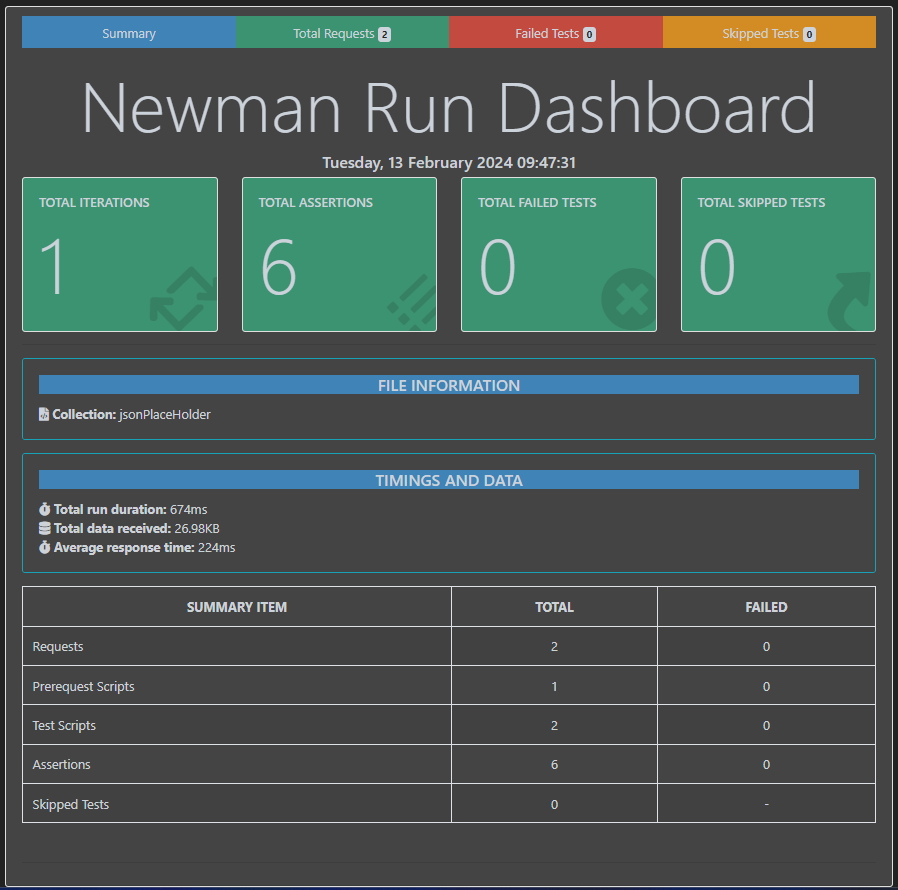

# POSTMAN

## Description
Use postman collection in newman

## Prerequisites
- Node.js and npm installed on your machine.
- Postman Collection exported from Postman.

## Installation
1. Clone the repository:
    ```bash
    git clone <repository_url>
    cd project-directory
    ```
2. Install dependencies:
    ```bash
    npm install
    ```

## Usage
1. Export your Postman Collection from Postman.
2. Place the exported `.json` file in the project directory.

### Running Tests with Newman
To run tests using Newman, follow these steps:

1. Make sure you're in the project directory.
2. Execute the following command:
    ```bash
    newman run collection_name.json
    ```
    Replace `collection_name.json` with the name of your Postman Collection file.

### Runing Tests using docker-compose
1. To start tests on docker execute the following command:
```bash
docker-compose up
```

### Running Tests with Specific Environment
If your collection requires a specific environment, you can pass it to Newman using the `-e` flag:

```bash
newman run collection_name.json -e environment_file.json
```

### Generating HTML Reports
You can generate HTML reports for your test runs by adding the `-r htmlextra`:

```bash
newman run collection_name.json -r htmlextra
```


## Troubleshooting
- If you encounter any issues during installation or execution, please refer to the Newman documentation: [Newman Documentation](https://learning.postman.com/docs/running-collections/using-newman-cli/command-line-integration-with-newman/)
